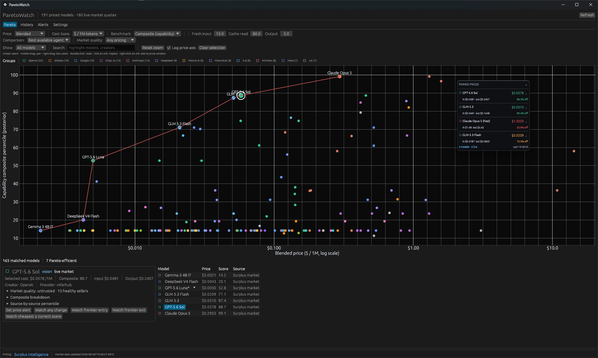

# ParetoWatch

[](https://github.com/Siroro/paretowatch/actions/workflows/release.yml)
[](https://github.com/Siroro/paretowatch/releases)

A lightweight native Rust tray app that tracks [Surplus Intelligence](https://surplusintelligence.ai) AI-model pricing and plots price/quality Pareto frontiers. It polls market prices every 30 seconds and public benchmark leaderboards every six hours, entirely locally — all data sources are public and need no API keys.



- **Pareto chart** — blended price per 1M tokens against your choice of benchmark score, with the efficient frontier labelled. Right-click a model to pin its live prices to a floating always-on-top widget.
- **Composite scores** — locally-computed capability and deployment scores that fuse all the benchmark boards instead of trusting any single leaderboard.
- **Alerts** — desktop notifications on price thresholds, any price move, frontier entries/exits, and cheapest-model-above-score changes.
- **History** — an append-only event log that records only actual changes and rebuilds per-model price/score series.

## Running

```powershell
cargo run --release
```

The app starts hidden in the tray; opening creates a normal taskbar entry, hiding removes it while polling and alerting continue. Runs on Windows and Linux. Prebuilt binaries for tagged releases are on the [releases page](https://github.com/Siroro/paretowatch/releases).

MIT licensed — see [LICENSE](LICENSE).
